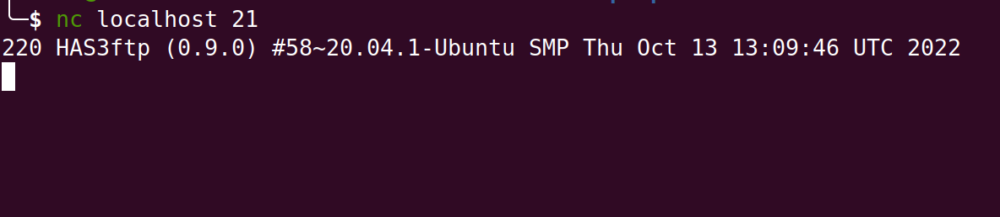
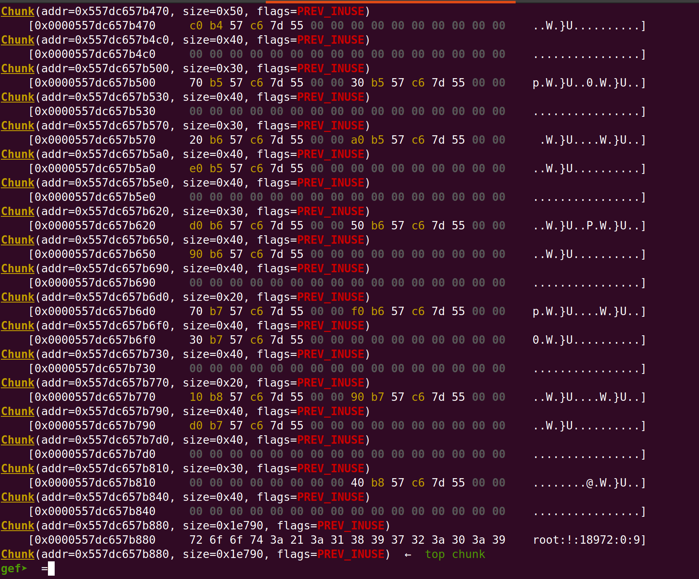
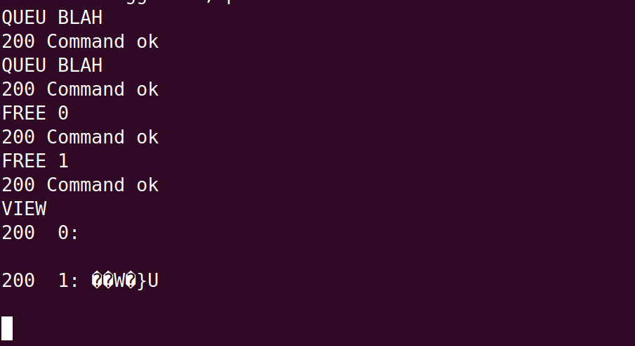

# **Has-ftpd**
This problem was a pretty cool one. While we didn’t solve it during the competition, I was able to get further with it afterwards to the point that I was able to start a bash session on the remote machine.

# **The Challenge**
The challenge was an ftp server that we could connect to. On starting up, the ftp server prints a unique ftp server version, so it seemed pretty likely that it was a custom implementation 

From the ftp server, we could pull down the binary running the server, `has-ftpd`, but not much else.

Upon putting the binary in Ghidra and reverse engineering a lot of it, it appears that it is a standard ftp server with a few modifications. First, while you might be able to list the contents of different directories, actually changing directories or pulling a file down from a different directory than the one you are in is not allowed. Initially, we saw a flag in a different directory and tried to download it, but the owner of the file was different from our user, so we couldn’t go any further without finding a bug somewhere.

One of the changes in the server was that there were also a few custom commands: `QUEU`, `EXEC`, `VIEW`, and `FREE`. These commands appear to be meant to queue up ftp commands so that you  can execute multiple commands all at the same time. The implementation is a singly linked list that is built by setting the list head to the most recently added node, so it essentially building the linked list backwards. Upon calling `EXEC`, all of the queued commands are iterated, executed, then freed. An important limitation of the `QUEU` command is that the value stored must be 4 characters followed by a space before any additional string can be added. E.g. `QUEU LIST` and `QUEU AAAA A` would be valid commands, but `QUEU BBBBB` would not be.
The last command, `VIEW`, goes through the linked list and prints out the first space-terminated string of each queued command. E.g. `USER blah` would print `USER`.

One of our teammates noticed pretty quickly that these weren’t typical ftp commands, and he also noticed that the `FREE` command frees a node on the list, but does not actually unlink it from the list, meaning that right away we had use-after-free and doublefree primitives that we could use.

Attaching `gdb` to the ftp server showed that the process forks on opening a new connection, and the child process is the one that actually handles the commands. Because the process forks like this, the process’ address space remains the same across multiple different ftp sessions. While not initially very relevant, this behavior essentially allows us to reset the heap to the same state it was in initially, while any information gathered (or pointers leaked) will still be accurate for future ftp sessions.

While looking around at the heap, we noticed that the heap was fairly fragmented, so any exploit would require a bit of a heap grooming to make the heap stable. Due to the forking behavior mentioned above, the state of the heap will always be the same, so the heap "groom" really just needs to fill a few holes for any chunk sizes that are needed for the exploit.

## **Exploit**
### **Exploit Plan**
Our initial plan looked something like this:
- get a heap leak
- get a libc leak from a libc pointer written to the heap
- create new nodes for our command queue that can groom the heap a little bit
- try to abuse the UAF to link in a chunk to `malloc`'s freelists that we control the pointers of (tcache is also a possible target if we choose a size that hasn’t had all of its tcache entries used up already)
- try to abuse freelists to get an arbitrary write into libc
- write a `one_gadget` into `__(malloc|free|calloc)_hook` in libc
- pop shell

### **Leaking pointers**
To leak some pointers, we just allocated a few nodes (by `QUEU`ing up some dummy commands), called `FREE` on each node, and then ran the `VIEW` command on each node to print the value of one of `malloc`'s freelist pointers to the terminal.

Due to the way that glibc's freelists are implemented, this technique was sufficient to leak both some `heap` pointers and a pointer to a global structure contained within `libc` itself. Using this pointer, we were able to determine the base address of `libc` in memory, as the pointer points to the same offset within `libc` every time. 

### **Memory Corruption**
#### **House-of-Botcake**
While we were analyzing the binary, one of our teammates mentioned that they thought the binary would be vulnerable to [House of Botcake](https://github.com/shellphish/how2heap/blob/master/glibc_2.35/house_of_botcake.c), a known heap-exploitation technique. The technique is well-documented online, so I won't go too far into it, but the general idea of the technique is to bypass double-free restrictions imposed by `libc`:
- Allocate two similarly-sized chunks on the heap right next to eachother, `A` and `B`
- Free `B` 
- Free `A` so that `A` and `B` consolidate into one larger-sized chunk that starts at the address of `A` and continues through what used to be `B`
- Allocate a chunk the size of `B` again to move `B` to the `tcache` list (so `A` and `B` are on separate freelists)
- free `B` again (triggering the double-free, but bypassing the detection for double-frees)
- Allocate a chunk the size of `A` + `B`, call it `C`
- Allocate a chunk the size of `B`. This chunk resides within chunk `C`

This technique results in an `overlapping-chunks` primitive, meaning that modifications to the larger chunk can overwrite portions of the smaller chunk, even if that chunk is free'd.

#### **Tcache-poisoning for an arbitrary write**
Using the Overlapping chunks primitive, I was able to get an arbitrary write by overwriting the `fwd` pointer of a free'd chunk (chunk `B`) with the address of `__free_hook` in `libc`. After overwriting the pointer, allocating twice allocates a chunk that can write into `__free_hook`. From here calling `FREE` on a chunk allocated with `QUEU exec /bin/sh -c 'sh; cat -'\x00` is enough to start a shell on the server, as well as bypass a slight issue with sockets (at least locally, I never got a chance to try it remotely).